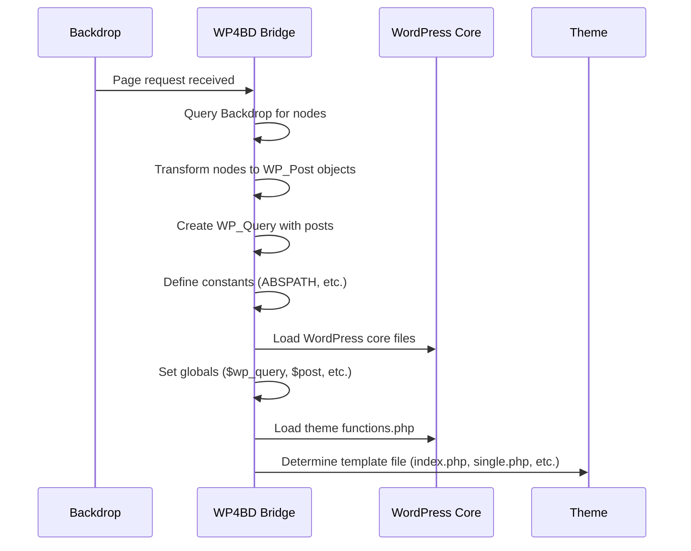
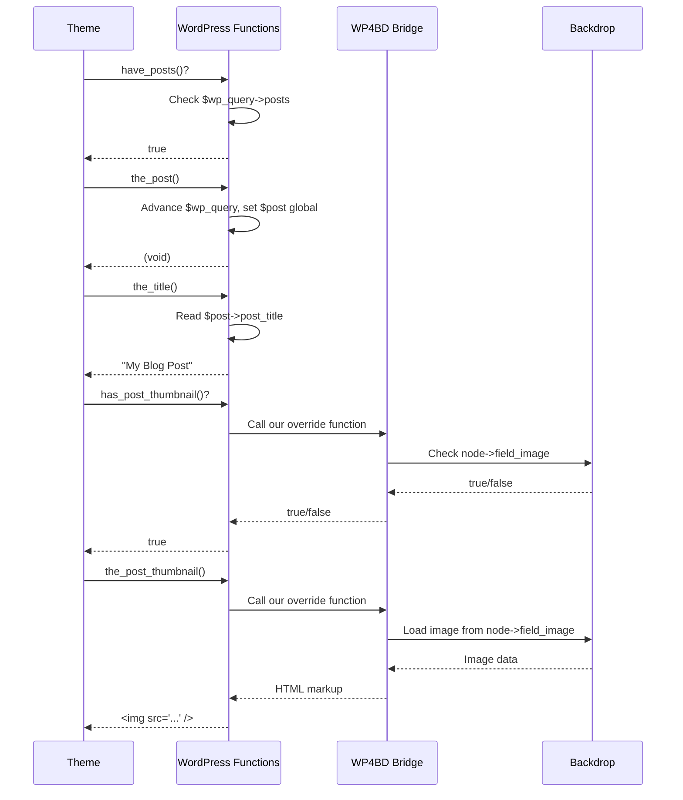

# WP4BD Architecture: WordPress-as-Engine

**Status:** Proposal
**Date:** December 2025
**Version:** 1.0

---

## Executive Summary

This document describes the **WordPress-as-Engine** architecture for WP4BD - an approach where actual WordPress 4.9 core files are loaded and used for rendering, rather than reimplementing WordPress functions piece-by-piece.

**Key Principle:** WordPress becomes a pure rendering engine. Backdrop handles all data storage and retrieval. WordPress just displays it.

---

## Core Concept

### Current Approach (Reimplementation)
```
Backdrop Data → Custom WP_Post → Custom WP_Query → Custom WP Functions → Theme
```

### New Approach (WordPress-as-Engine)
```
Backdrop Data → Real WP_Post → Real WP_Query → Real WordPress → Theme
```

**The Difference:** Instead of writing our own versions of WordPress classes and functions, we load the actual WordPress 4.9 codebase and use it directly.

---

## System Architecture

### Layer 1: Backdrop (Data Layer) 🔵

**Responsibilities:**
- Store all content in Backdrop nodes
- Handle all database operations
- Provide admin UI for content editing
- Manage users, permissions, configuration

**Key Point:** This is unchanged from current Backdrop. Users see Backdrop's admin interface, not WordPress.

### Layer 2: WP4BD Bridge (Translation Layer) 🟡

**Responsibilities:**
- Query Backdrop for nodes
- Transform Backdrop nodes → WordPress WP_Post objects
- Populate WordPress globals ($wp_query, $post)
- Load WordPress core files
- Intercept WordPress's data-fetching functions
- Inject Backdrop assets into WordPress HTML

**Key Point:** This is OUR code - the glue between systems.

### Layer 3: WordPress (Rendering Layer) 🟣

**Responsibilities:**
- Load from `/wordpress-4.9/` directory
- Provide WP_Query, WP_Post, and all WordPress classes
- Provide all WordPress template tag functions
- Execute theme template files
- Generate HTML output

**Key Point:** This is unmodified WordPress 4.9 code. We just load it.

### Layer 4: WordPress Theme (Presentation Layer) 🟣

**Responsibilities:**
- Define HTML structure
- Call WordPress template tags
- Apply CSS styling
- Execute JavaScript

**Key Point:** Unmodified WordPress themes from the wild.

---

## Communication Flow

### Initial Setup (One-Time)



### Rendering Loop (Continuous)



---

## Data Transformation

### Backdrop Node → WordPress WP_Post

```php
// Backdrop has this:
$node = (object) [
  'nid' => 123,
  'title' => 'My Blog Post',
  'body' => ['und' => [0 => ['value' => '<p>Content...</p>']]],
  'created' => 1701388200,
  'changed' => 1701388200,
  'uid' => 1,
  'type' => 'post',
  'status' => 1,
];

// We transform to WordPress WP_Post:
$wp_post = new WP_Post((object) [
  'ID' => 123,
  'post_title' => 'My Blog Post',
  'post_content' => '<p>Content...</p>',
  'post_date' => '2023-11-30 15:30:00',
  'post_date_gmt' => '2023-11-30 23:30:00',
  'post_modified' => '2023-11-30 15:30:00',
  'post_modified_gmt' => '2023-11-30 23:30:00',
  'post_author' => '1',
  'post_type' => 'post',
  'post_status' => 'publish',
  'comment_status' => 'open',
  'ping_status' => 'closed',
  'post_name' => 'my-blog-post',
  'guid' => 'http://example.com/?p=123',
  'post_parent' => 0,
  'menu_order' => 0,
  'comment_count' => '0',
]);
```

**Key Insight:** This uses the REAL `WP_Post` class from WordPress core, not a custom one.

---

## Function Interception Strategy

### Functions We DON'T Override

WordPress provides these - we just use them:

- `the_title()` - Reads from `$post->post_title`
- `the_content()` - Reads from `$post->post_content`
- `the_ID()` - Reads from `$post->ID`
- `is_single()` - Reads from `$wp_query->is_single`
- `have_posts()` - Checks `$wp_query->posts`
- `the_post()` - Advances `$wp_query->current_post`
- `get_header()` - Includes `header.php`
- `apply_filters()` - WordPress hook system
- ...hundreds more

**We get all of these for free by loading WordPress!**

### Functions We DO Override

These need to query Backdrop data:

```php
// Image/attachment functions
function has_post_thumbnail($post_id = null) {
  $node = _wp4bd_get_node($post_id);
  return !empty($node->field_image);
}

function get_the_post_thumbnail($post_id = null, $size = 'post-thumbnail') {
  $node = _wp4bd_get_node($post_id);
  // Transform Backdrop image field to WordPress markup
  return _wp4bd_render_image($node->field_image, $size);
}

// Metadata functions
function get_post_meta($post_id, $key = '', $single = false) {
  $node = _wp4bd_get_node($post_id);
  // Map WordPress meta keys to Backdrop fields
  return _wp4bd_get_node_field($node, $key, $single);
}

// Taxonomy functions
function get_the_category($post_id = 0) {
  $node = _wp4bd_get_node($post_id);
  // Transform Backdrop taxonomy terms to WordPress category objects
  return _wp4bd_get_terms($node, 'category');
}

// Author functions
function get_the_author() {
  global $post;
  $user = user_load($post->post_author);
  return $user->name;
}

// URL functions
function get_permalink($post_id = null) {
  $node = _wp4bd_get_node($post_id);
  return url('node/' . $node->nid, ['absolute' => TRUE]);
}
```

**Strategy:** We only override functions that need to fetch data from Backdrop. Everything else uses real WordPress.

---

## Database Isolation

WordPress core expects to query a database via the `$wpdb` global. We prevent this.

### Approach: Mock wpdb Class

Create `/wp-content/db.php` (WordPress automatically loads this):

```php
<?php
/**
 * Custom database handler for WP4BD
 * Prevents WordPress from making any database queries
 */

class wpdb {
  // Required properties
  public $prefix = 'wp_';
  public $posts = 'wp_posts';
  public $postmeta = 'wp_postmeta';
  public $options = 'wp_options';
  // ... other table names

  public $ready = true;
  public $last_query = '';
  public $num_queries = 0;

  // Stub out all query methods
  public function query($query) {
    $this->last_query = $query;
    $this->num_queries++;

    // Log if in debug mode
    if (WP4BD_DEBUG) {
      watchdog('wp4bd', 'Database query attempted: @query',
        ['@query' => $query], WATCHDOG_DEBUG);
    }

    return false;
  }

  public function get_results($query = null, $output = OBJECT) {
    return array();
  }

  public function get_row($query = null, $output = OBJECT, $y = 0) {
    return null;
  }

  public function get_col($query = null, $x = 0) {
    return array();
  }

  public function get_var($query = null, $x = 0, $y = 0) {
    return null;
  }

  public function prepare($query, ...$args) {
    return '';
  }

  public function insert($table, $data, $format = null) {
    return false;
  }

  public function update($table, $data, $where, $format = null, $where_format = null) {
    return false;
  }

  public function delete($table, $where, $where_format = null) {
    return false;
  }
}

// Set global
global $wpdb;
$wpdb = new wpdb();
```

**Result:** WordPress thinks it has a database connection, but all queries return empty. Since we pre-populate `$wp_query` and override data-fetching functions, WordPress never needs the database.

---

## WordPress Core Files to Load

### Minimal Bootstrap

We don't need the entire WordPress bootstrap - just the parts needed for theme rendering:

```php
// Define WordPress constants
define('ABSPATH', BACKDROP_ROOT . '/wordpress-4.9/');
define('WPINC', 'wp-includes');
define('WP_CONTENT_DIR', BACKDROP_ROOT . '/wordpress-4.9/wp-content');
define('WP_DEBUG', FALSE);

// Load core WordPress files
require_once ABSPATH . WPINC . '/class-wp-post.php';
require_once ABSPATH . WPINC . '/class-wp-query.php';
require_once ABSPATH . WPINC . '/query.php';
require_once ABSPATH . WPINC . '/post.php';
require_once ABSPATH . WPINC . '/post-template.php';
require_once ABSPATH . WPINC . '/general-template.php';
require_once ABSPATH . WPINC . '/link-template.php';
require_once ABSPATH . WPINC . '/author-template.php';
require_once ABSPATH . WPINC . '/formatting.php';
require_once ABSPATH . WPINC . '/kses.php';
require_once ABSPATH . WPINC . '/plugin.php';
require_once ABSPATH . WPINC . '/theme.php';
require_once ABSPATH . WPINC . '/script-loader.php';
require_once ABSPATH . WPINC . '/l10n.php';

// Load our custom db.php to prevent database access
require_once WP_CONTENT_DIR . '/db.php';
```

### What We Skip

We don't need:
- `wp-admin/` - No admin interface
- `wp-load.php` - We bootstrap manually
- `wp-settings.php` - We load files selectively
- Database schema files
- Update/upgrade systems
- XML-RPC, REST API
- Cron system

**Result:** Much faster bootstrap, only ~20 files instead of 100+

---

## File Structure

```
backdrop-1.30/
├── modules/
│   └── wp_content/               # Backdrop module
│       └── wp_content.module     # Module hooks
│
├── themes/
│   └── wp/                       # Backdrop theme (wrapper)
│       ├── wp.info
│       ├── template.php          # Bridge functions
│       ├── templates/
│       │   └── page.tpl.php      # Renders WordPress output
│       └── wp-content/
│           ├── db.php            # Mock wpdb class
│           └── themes/           # WordPress themes
│               ├── twentyfourteen/
│               ├── twentyfifteen/
│               ├── twentysixteen/
│               └── twentyseventeen/
│
└── wordpress-4.9/                # WordPress core files
    ├── wp-includes/              # WordPress functions & classes
    │   ├── class-wp-post.php
    │   ├── class-wp-query.php
    │   ├── post.php
    │   ├── post-template.php
    │   ├── general-template.php
    │   └── ...
    └── wp-content/
        └── themes/               # Symlink to themes/wp/wp-content/themes
```

---

## Execution Flow (Detailed)

### 1. Request Arrives at Backdrop

```php
// Backdrop's normal routing
// User visits: http://example.com/blog/my-post
// Backdrop routes to node/123
```

### 2. Backdrop Theme System Activates

```php
// themes/wp/templates/page.tpl.php is selected
// This is a Backdrop theme template
```

### 3. Bridge Initialization

```php
// In page.tpl.php

// Load WordPress core
if (!defined('ABSPATH')) {
  require_once BACKDROP_ROOT . '/themes/wp/template.php';
  _wp4bd_bootstrap_wordpress();
}
```

### 4. Query Backdrop for Data

```php
// Query Backdrop database
$nids = db_select('node', 'n')
  ->fields('n', ['nid'])
  ->condition('status', 1)
  ->condition('promote', 1)
  ->range(0, 10)
  ->execute()
  ->fetchCol();

$nodes = node_load_multiple($nids);
```

### 5. Transform to WordPress Objects

```php
// Transform each node to WP_Post
$posts = [];
foreach ($nodes as $node) {
  $posts[] = _wp4bd_node_to_wp_post($node);
}
```

### 6. Populate WordPress Globals

```php
// Create and populate WP_Query
global $wp_query, $wp_the_query, $post;

$wp_query = new WP_Query(); // Real WordPress class!
$wp_query->posts = $posts;
$wp_query->post_count = count($posts);
$wp_query->current_post = -1;
$wp_query->is_home = true;
$wp_query->is_front_page = true;

$wp_the_query = $wp_query;
$post = null; // Set by the_post()
```

### 7. Load Theme functions.php

```php
// WordPress theme initialization
$theme_functions = get_template_directory() . '/functions.php';
if (file_exists($theme_functions)) {
  require_once $theme_functions;
}

// Theme registers hooks, adds theme support, etc.
do_action('after_setup_theme');
do_action('wp_enqueue_scripts');
```

### 8. Determine Template File

```php
// WordPress template hierarchy
if ($wp_query->is_single) {
  $template = 'single.php';
} elseif ($wp_query->is_page) {
  $template = 'page.php';
} elseif ($wp_query->is_home) {
  $template = 'index.php';
}

$template_path = get_template_directory() . '/' . $template;
```

### 9. Execute Template (The Loop Runs)

```php
// Capture output
ob_start();

// Include WordPress template
include $template_path;

// Template contains:
// <?php while (have_posts()) : the_post(); ?>
//   <?php the_title(); ?>
//   <?php the_content(); ?>
// <?php endwhile; ?>

$html = ob_get_clean();
```

### 10. Inject Backdrop Assets

```php
// Add Backdrop's CSS/JS to WordPress HTML
$backdrop_head = backdrop_get_html_head() . "\n"
               . backdrop_get_css() . "\n"
               . backdrop_get_js();

$html = preg_replace('/<\/head>/i', $backdrop_head . "\n</head>", $html, 1);

// Add Backdrop admin toolbar, etc.
$backdrop_footer = backdrop_get_js('footer');
$html = preg_replace('/<\/body>/i', $backdrop_footer . "\n</body>", $html, 1);
```

### 11. Output to Browser

```php
print $html;
```

---

## Function Override Examples

### Example 1: Image Functions

```php
/**
 * Check if post has a featured image
 *
 * WordPress core version queries post_meta table.
 * Our version checks Backdrop node fields.
 */
function has_post_thumbnail($post_id = null) {
  if (empty($post_id)) {
    global $post;
    $post_id = $post->ID;
  }

  $node = node_load($post_id);
  if (!$node) {
    return false;
  }

  // Check if field_image has data
  return !empty($node->field_image[LANGUAGE_NONE][0]['fid']);
}

/**
 * Get the post thumbnail HTML
 */
function get_the_post_thumbnail($post_id = null, $size = 'post-thumbnail', $attr = '') {
  if (!has_post_thumbnail($post_id)) {
    return '';
  }

  $node = node_load($post_id);
  $image = $node->field_image[LANGUAGE_NONE][0];

  // Use Backdrop's image rendering
  $output = theme('image_style', [
    'style_name' => _wp4bd_size_to_style($size),
    'path' => $image['uri'],
    'alt' => $image['alt'],
    'title' => $image['title'],
  ]);

  return $output;
}
```

### Example 2: Metadata Functions

```php
/**
 * Get post meta value
 *
 * Maps WordPress meta keys to Backdrop fields
 */
function get_post_meta($post_id, $key = '', $single = false) {
  $node = node_load($post_id);
  if (!$node) {
    return $single ? '' : [];
  }

  // Map common WordPress meta keys to Backdrop fields
  $field_map = [
    '_thumbnail_id' => 'field_image',
    '_wp_page_template' => 'field_template',
    // Add more mappings as needed
  ];

  if (isset($field_map[$key])) {
    $field_name = $field_map[$key];
    if (isset($node->{$field_name})) {
      $value = $node->{$field_name}[LANGUAGE_NONE][0]['value'];
      return $single ? $value : [$value];
    }
  }

  return $single ? '' : [];
}
```

### Example 3: Taxonomy Functions

```php
/**
 * Get post categories
 */
function get_the_category($post_id = 0) {
  if (!$post_id) {
    global $post;
    $post_id = $post->ID;
  }

  $node = node_load($post_id);
  if (!$node || empty($node->field_tags)) {
    return [];
  }

  $categories = [];
  foreach ($node->field_tags[LANGUAGE_NONE] as $term_ref) {
    $term = taxonomy_term_load($term_ref['tid']);

    // Convert Backdrop term to WordPress category object
    $cat = new stdClass();
    $cat->term_id = $term->tid;
    $cat->name = $term->name;
    $cat->slug = $term->name; // Could be improved
    $cat->description = isset($term->description) ? $term->description : '';

    $categories[] = $cat;
  }

  return $categories;
}
```

---

## Performance Considerations

### Caching Strategy

**Level 1: Opcode Cache**
- PHP opcache will cache compiled WordPress core files
- Significant speedup after first page load

**Level 2: Output Caching**
- Cache the final HTML output per node
- Invalidate when node is updated

```php
$cache_key = 'wp4bd:node:' . $node->nid . ':' . $node->changed;
$cached = cache_get($cache_key);

if ($cached) {
  return $cached->data;
}

// Render with WordPress
$html = _wp4bd_render($node);

// Cache for 1 hour
cache_set($cache_key, $html, 'cache', time() + 3600);
```

**Level 3: Object Caching**
- WordPress's `wp_cache_*` functions can be implemented
- Cache transformed WP_Post objects
- Cache loaded nodes

### Optimization Opportunities

1. **Lazy Loading WordPress Files**
   - Only load files when needed
   - Theme-specific file loading

2. **Node Preloading**
   - Load multiple nodes in one query
   - Cache node_load() calls

3. **Asset Aggregation**
   - Combine CSS/JS files
   - Use Backdrop's aggregation system

---

## Migration Path

### Phase 1: WordPress-as-Engine (This Architecture)

**Goal:** Maximum compatibility with WordPress themes

**Features:**
- Real WordPress rendering
- Unmodified WordPress themes work
- 1-region layout (WordPress controls full page)

**User Experience:**
- Edit content in Backdrop admin
- WordPress theme displays it
- Can switch between WordPress themes via admin UI

### Phase 2: Hybrid Mode (4-Region)

**Goal:** Enable Backdrop layout features

**Changes:**
- Split WordPress output into regions
- Add Backdrop blocks between WordPress regions
- Requires CSS tuning per theme

**User Experience:**
- WordPress handles header/content/sidebar/footer
- Can add Backdrop blocks in other regions
- Gradual Backdrop-ification

### Phase 3: Native Backdrop

**Goal:** Full Backdrop integration

**Changes:**
- Create native Backdrop theme
- Remove WordPress dependency
- Pure Backdrop site

**User Experience:**
- Full Backdrop layout system
- Native Backdrop theming
- WordPress compatibility layer optional/removed

---

## Error Handling

### WordPress Errors

WordPress may throw errors/exceptions. We catch them:

```php
try {
  include $template_path;
} catch (Exception $e) {
  watchdog('wp4bd', 'Template error: @error',
    ['@error' => $e->getMessage()], WATCHDOG_ERROR);

  // Fallback to Backdrop rendering
  return _wp4bd_fallback_render($node);
} catch (Error $e) {
  watchdog('wp4bd', 'Fatal error: @error',
    ['@error' => $e->getMessage()], WATCHDOG_ERROR);

  return _wp4bd_fallback_render($node);
}
```

### Missing Data

Handle missing data gracefully:

```php
function has_post_thumbnail($post_id = null) {
  try {
    $node = node_load($post_id);
    if (!$node) {
      return false;
    }
    return !empty($node->field_image);
  } catch (Exception $e) {
    watchdog('wp4bd', 'Error checking thumbnail: @error',
      ['@error' => $e->getMessage()], WATCHDOG_WARNING);
    return false;
  }
}
```

---

## Security Considerations

### Input Validation

WordPress handles its own escaping via:
- `esc_html()`
- `esc_attr()`
- `esc_url()`

These functions are provided by WordPress core - we use them as-is.

### Output Sanitization

All content from Backdrop should be sanitized before transforming to WP_Post:

```php
$wp_post->post_content = check_markup($node->body['und'][0]['value']);
$wp_post->post_title = check_plain($node->title);
```

### Database Isolation

Our mock `wpdb` prevents WordPress from:
- Reading Backdrop's database structure
- Modifying Backdrop's data
- SQL injection attacks via WordPress

---

## Testing Strategy

### Unit Tests

Test individual transformation functions:

```php
class WP4BDTransformTest extends BackdropWebTestCase {
  function testNodeToWPPost() {
    $node = $this->backdropCreateNode();
    $wp_post = _wp4bd_node_to_wp_post($node);

    $this->assertEqual($wp_post->ID, $node->nid);
    $this->assertEqual($wp_post->post_title, $node->title);
  }
}
```

### Integration Tests

Test complete rendering:

```php
class WP4BDRenderTest extends BackdropWebTestCase {
  function testWordPressRendering() {
    $node = $this->backdropCreateNode();

    $this->backdropGet('node/' . $node->nid);
    $this->assertText($node->title);
    $this->assertRaw('wp-content/themes/'); // WordPress theme loaded
  }
}
```

### Theme Compatibility Tests

Test with multiple themes:

```php
function testMultipleThemes() {
  $themes = ['twentyfourteen', 'twentyfifteen', 'twentysixteen', 'twentyseventeen'];

  foreach ($themes as $theme) {
    config_set('wp_content.settings', 'active_theme', $theme);
    $this->backdropGet('node/1');
    $this->assertResponse(200);
    $this->assertNoRaw('Warning:');
    $this->assertNoRaw('Fatal error:');
  }
}
```

---

## Future Enhancements

### Potential Additions

1. **WordPress Plugin Support**
   - Load select WordPress plugins
   - Security implications need careful consideration

2. **Dynamic WordPress Version**
   - Support WordPress 4.8, 4.9, 5.0 (pre-Gutenberg)
   - Configurable WordPress version

3. **Custom Field Mapping UI**
   - Admin interface to map Backdrop fields to WordPress meta keys
   - Auto-detect common patterns

4. **Performance Dashboard**
   - Show WordPress file load times
   - Cache hit rates
   - Function call counts

---

## Glossary

**Backdrop:** The CMS that stores and manages content
**WordPress Core:** The WordPress 4.9 codebase we load
**WP4BD Bridge:** Our translation layer between systems
**WP_Post:** WordPress's post object class
**WP_Query:** WordPress's query class
**The Loop:** WordPress's iteration mechanism for displaying posts
**Template Tags:** WordPress functions like `the_title()`, `the_content()`
**wpdb:** WordPress's database class (we mock it)
**On-Demand Loading:** Fetching data only when requested

---

## Naming Conventions

Throughout this architecture:

- **`_wp4bd_*`** - Our bridge functions (internal)
- **`wp4bd_*`** - Our public API functions
- **`WP_*`** - WordPress core classes (unchanged)
- **`$wp_query`** - WordPress global (real WordPress)
- **`$post`** - WordPress global (real WordPress)

---

## References

- WordPress 4.9 Codex: https://codex.wordpress.org/
- Backdrop API Documentation: https://api.backdropcms.org/
- WP4BD Project Plan: `/DOCS/Project Plan_ WordPress Theme Compatibility Layer.md`
- Current Implementation: `/backdrop-1.30/modules/wp_content/`

---

## Questions for Consideration

1. **Should we support multiple WordPress versions?** Start with 4.9, add others later?
2. **Plugin support - yes or no?** Security implications?
3. **How to handle WordPress updates?** Lock to 4.9 or allow updates?
4. **Custom field mapping - automatic or manual?** UI complexity vs flexibility
5. **Performance targets?** What's acceptable page load time?

---

**End of Architecture Document**
