# WP4BD Request Lifecycle - Mermaid Diagrams

## 1. High-Level System Flow

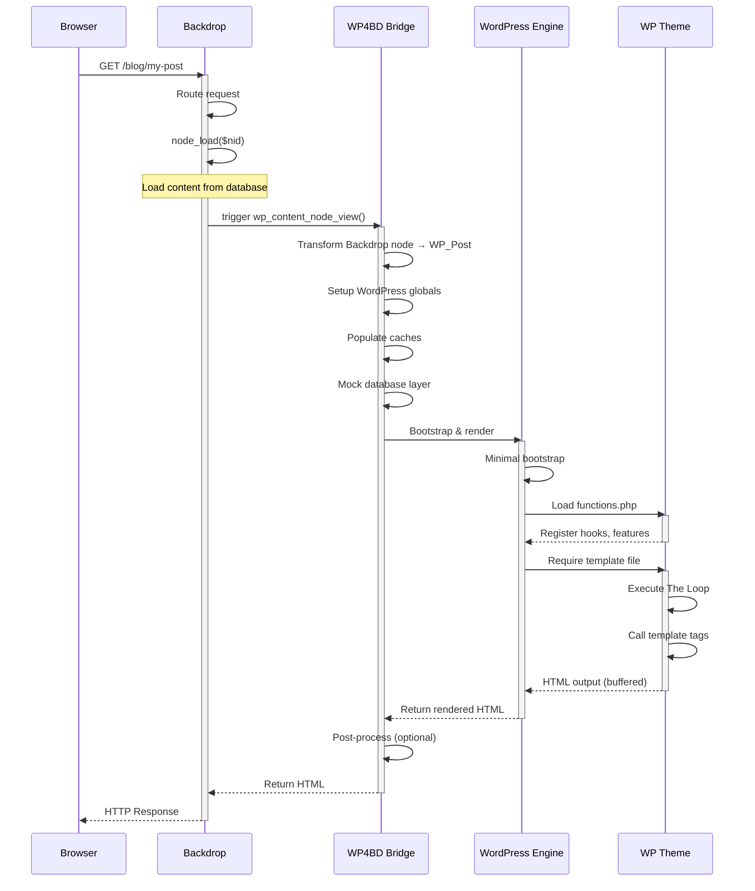

## 2. Data Transformation Flow

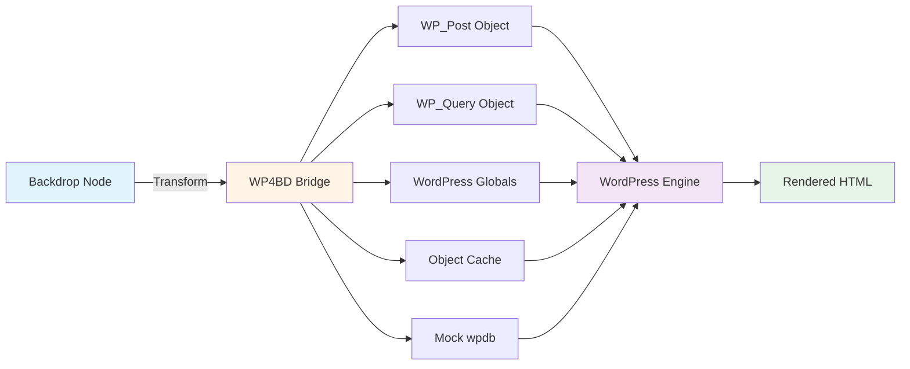

## 3. WordPress Environment Setup (Detailed)

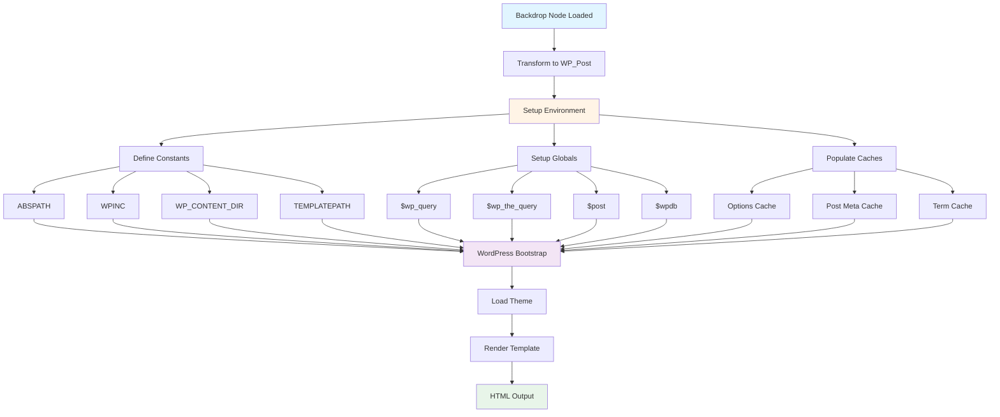

## 4. The WordPress Loop Execution

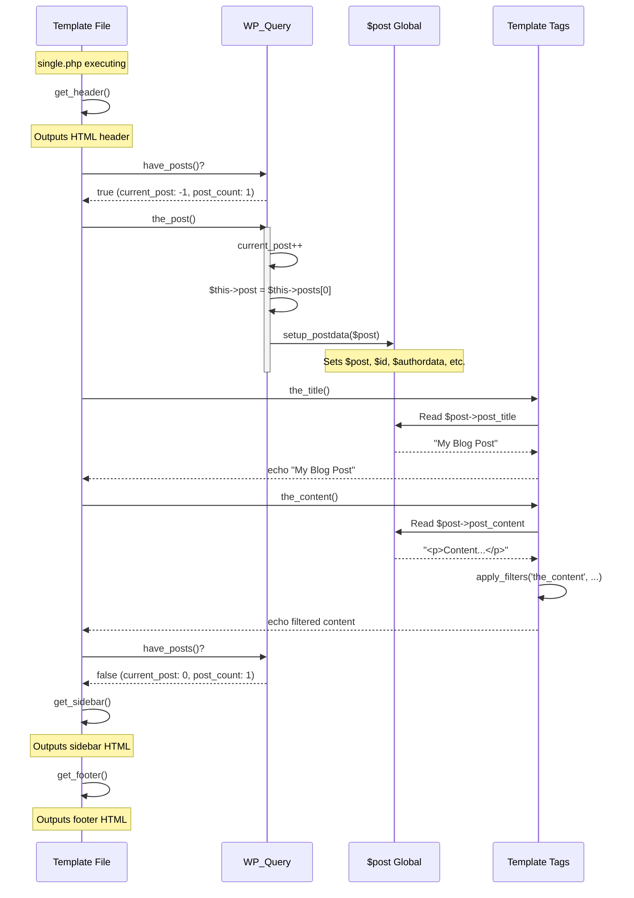

## 5. Template Hierarchy & File Loading

```mermaid
graph TD
    Start[Request: Single Post] --> CheckSingle{is_single?}

    CheckSingle -->|Yes| T1[Try: single-post.php]
    T1 -->|Not found| T2[Try: single.php]
    T2 -->|Not found| T3[Try: singular.php]
    T3 -->|Not found| T4[Try: index.php]
    T4 --> LoadTemplate[Load Template File]

    CheckSingle -->|No| CheckPage{is_page?}
    CheckPage -->|Yes| P1[Try: page-{slug}.php]
    P1 -->|Not found| P2[Try: page-{id}.php]
    P2 -->|Not found| P3[Try: page.php]
    P3 -->|Not found| P4[Try: singular.php]
    P4 -->|Not found| P5[Try: index.php]
    P5 --> LoadTemplate

    CheckPage -->|No| CheckHome{is_home?}
    CheckHome -->|Yes| H1[Try: home.php]
    H1 -->|Not found| H2[Try: index.php]
    H2 --> LoadTemplate

    CheckHome -->|No| CheckArchive{is_archive?}
    CheckArchive -->|Yes| A1[Try: archive-{post_type}.php]
    A1 -->|Not found| A2[Try: archive.php]
    A2 -->|Not found| A3[Try: index.php]
    A3 --> LoadTemplate

    LoadTemplate --> Execute[Execute Template]
    Execute --> Output[HTML Output]

    style Start fill:#e1f5ff
    style LoadTemplate fill:#fff4e6
    style Execute fill:#f3e5f5
    style Output fill:#e8f5e9
```

## 6. Template Tag Execution Flow

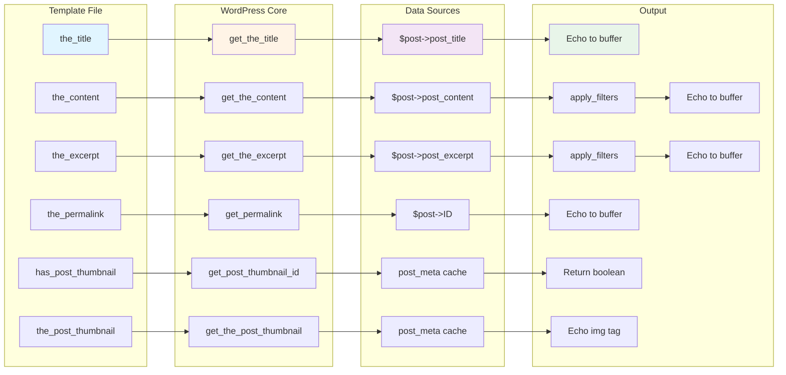

## 7. Hook System Execution

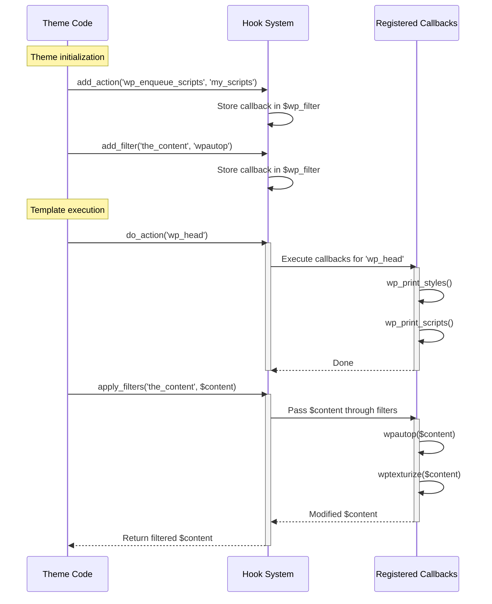

## 8. Database Isolation Architecture

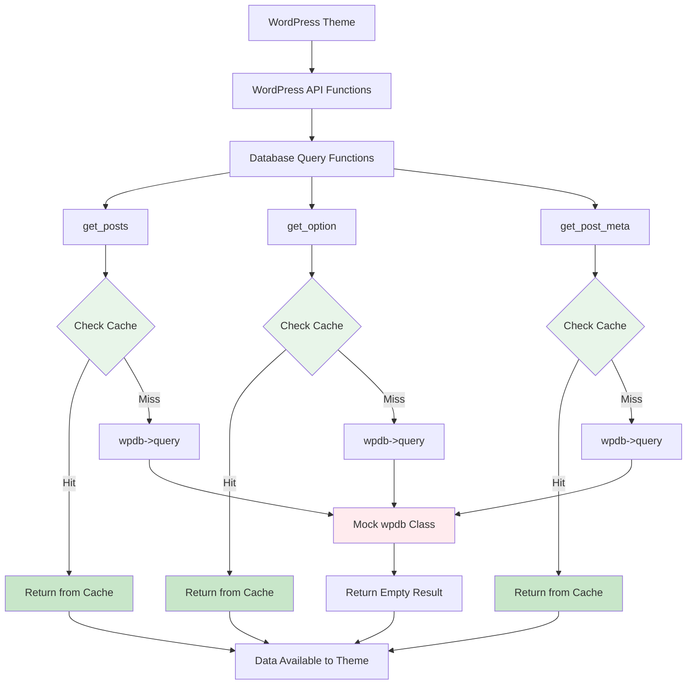

## 9. Complete Request Timeline

```mermaid
gantt
    title WP4BD Request Processing Timeline
    dateFormat X
    axisFormat %L ms

    section Backdrop
    Route Request           :0, 5
    Load Node              :5, 20
    Trigger WP4BD          :20, 5

    section WP4BD Bridge
    Transform Data         :25, 15
    Setup Environment      :40, 20
    Populate Caches        :60, 10
    Mock Database          :70, 5

    section WordPress
    Bootstrap Core         :75, 30
    Load Theme Functions   :105, 10
    Determine Template     :115, 5
    Start Output Buffer    :120, 1

    section Template Execution
    get_header()           :121, 15
    wp_head()              :136, 20
    The Loop               :156, 40
    Template Tags          :196, 30
    get_sidebar()          :226, 10
    get_footer()           :236, 10
    wp_footer()            :246, 15

    section Output
    Capture Buffer         :261, 5
    Post-process           :266, 5
    Return to Backdrop     :271, 5
    Send Response          :276, 10
```

## 10. WP_Query State Diagram

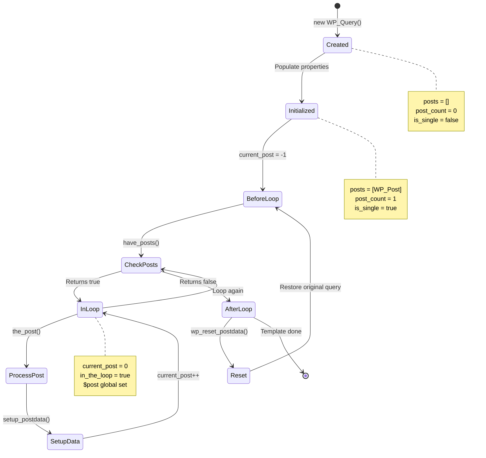

## 11. Cache Population Strategy

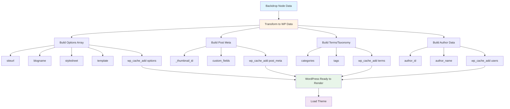

## 12. Error Handling Flow

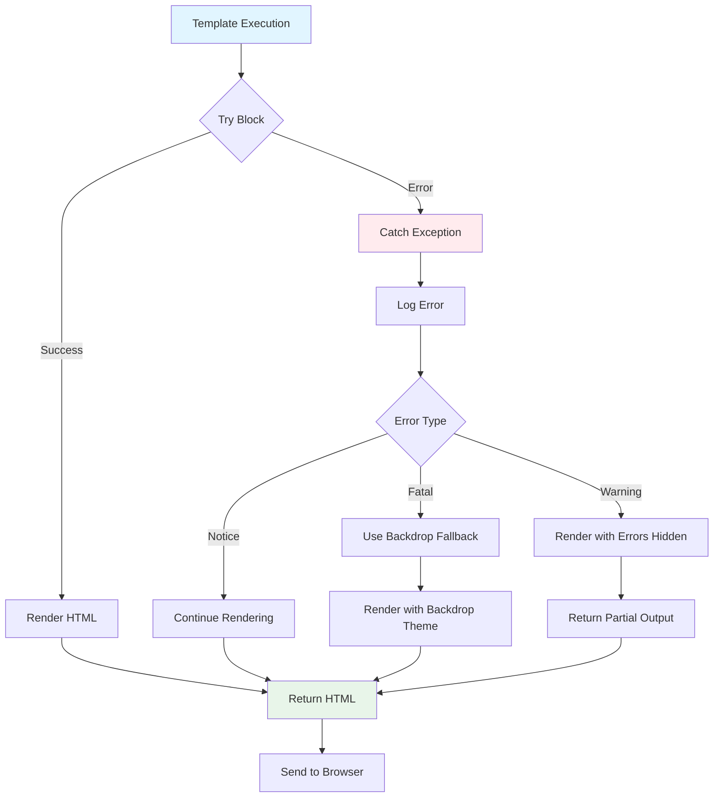

## Usage Notes

These Mermaid diagrams can be viewed in:
- GitHub (renders Mermaid natively)
- VS Code (with Mermaid extension)
- Any Markdown viewer with Mermaid support
- Online at https://mermaid.live/

To edit/customize, copy any diagram code block to the Mermaid Live Editor.
