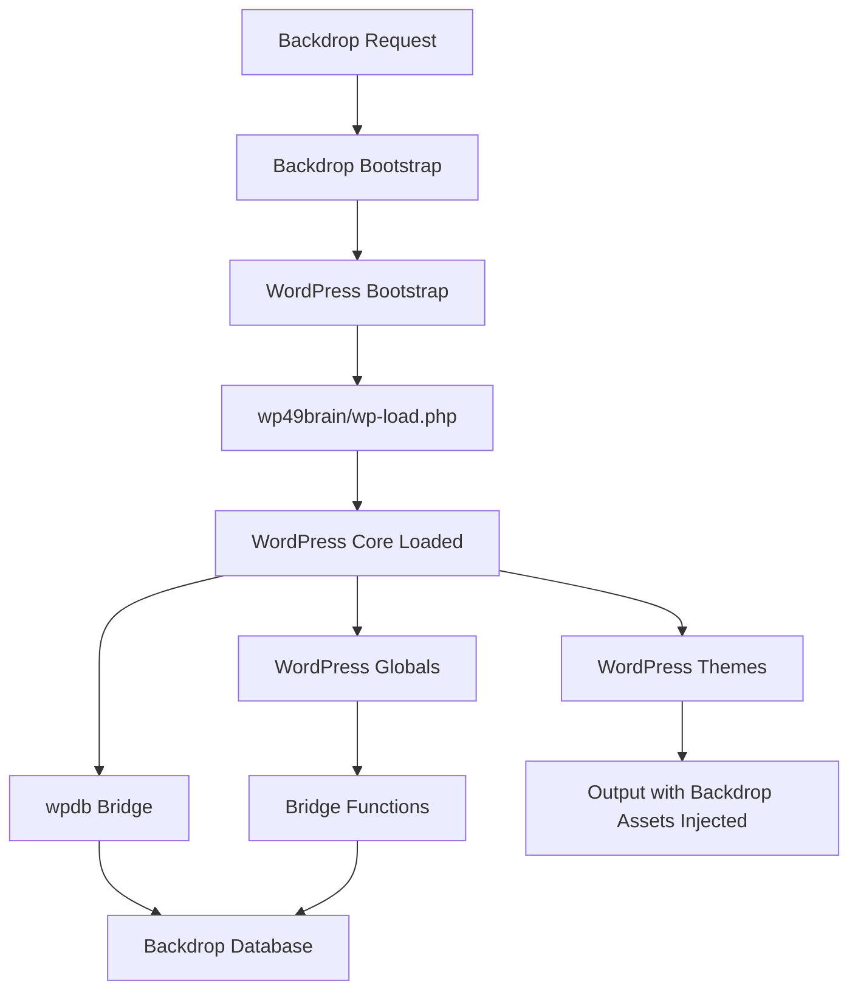

# WordPress Core Integration for Backdrop

## Overview

Move from stub-based compatibility layer to actual WordPress 4.9 core loaded in "headless" mode. WordPress core will run but database and external I/O will be intercepted and bridged to Backdrop.

## Architecture



## Phase 1: Setup WordPress Core

### 1.1 Copy WordPress to Backdrop Directory

- **Source:** `wordpress-4.9/` (already exists)
- **Destination:** `backdrop-1.30/wp49brain/`
- **Action:** Copy entire WordPress directory structure
- **Files to Modify:** None initially - keep WordPress core pristine

### 1.2 Create WordPress Bootstrap Entry Point

- **File:** `backdrop-1.30/modules/wp_content/includes/wp-bootstrap.php`
- **Purpose:** Initialize WordPress with Backdrop-specific configuration
- **Key tasks:**
  - Set WordPress constants (`ABSPATH`, `WPINC`, etc.)
  - Redirect WordPress paths to wp49brain
  - Prevent WordPress from connecting to its own database
  - Load WordPress after Backdrop bootstrap phase FULL

### 1.3 Create wp-config Bridge

- **File:** `backdrop-1.30/wp49brain/wp-config-bd.php`
- **Purpose:** WordPress configuration that prevents database connection
- **Key constants:**
  - Set fake DB credentials (WordPress will try to connect but we'll intercept)
  - Or use WordPress's `db.php` drop-in mechanism (preferred - see Phase 2)

## Phase 2: Database Interception Layer

### 2.1 Replace wpdb Class via Drop-in

WordPress allows replacing `wpdb` by creating `wp-content/db.php`. This is the cleanest interception point.

- **File:** `backdrop-1.30/wp49brain/wp-content/db.php`
- **Action:** Extend `wpdb` class and override key methods:
  - `query()` - Main query execution
  - `get_results()` - SELECT queries
  - `get_var()` - Single value queries  
  - `get_row()` - Single row queries
  - `prepare()` - Query preparation (may need to map to Backdrop placeholders)
  - `insert()` - INSERT queries (disabled or logged)
  - `update()` - UPDATE queries (disabled or logged)
  - `delete()` - DELETE queries (disabled or logged)

### 2.2 SQL Query Analysis and Mapping

- **Task:** Identify WordPress SQL patterns and map to Backdrop equivalents
- **Common patterns:**
  - `SELECT * FROM wp_posts WHERE ...` → Backdrop node queries
  - `SELECT * FROM wp_users WHERE ...` → Backdrop user queries
  - `SELECT * FROM wp_terms WHERE ...` → Backdrop taxonomy queries
  - `SELECT * FROM wp_options WHERE ...` → Backdrop config/variables
  - `SELECT * FROM wp_postmeta WHERE ...` → Backdrop field API

- **File:** `backdrop-1.30/modules/wp_content/includes/wpdb-bridge.php`
- **Methods needed:**
  - `_parse_wp_query($sql)` - Analyze WordPress SQL
  - `_convert_to_backdrop_query($parsed)` - Map to Backdrop query builder
  - `_execute_backdrop_query($query)` - Execute via Backdrop DB API

### 2.3 Query Result Transformation

- **Task:** Transform Backdrop query results to WordPress object format
- **File:** `backdrop-1.30/modules/wp_content/includes/wpdb-bridge.php`
- **Methods:**
  - `_backdrop_node_to_wp_post($node)` - Already exists, reuse
  - `_backdrop_user_to_wp_user($account)` - Convert user objects
  - `_backdrop_term_to_wp_term($term)` - Convert taxonomy terms
  - `_backdrop_config_to_wp_option($config)` - Convert settings

## Phase 3: WordPress Global Variables Setup

### 3.1 Identify Critical WordPress Globals

From `wp-settings.php` and WordPress core, key globals include:

- `$wpdb` - Database object (replaced by bridge)
- `$wp_query` - Main query object
- `$wp_the_query` - Original query object
- `$wp_rewrite` - Rewrite rules object
- `$wp` - Main WordPress object
- `$post` - Current post object
- `$posts` - Array of post objects
- `$wp_post_types` - Registered post types
- `$wp_taxonomies` - Registered taxonomies
- `$wp_theme` - Current theme object
- `$wp_filter` - Action/filter hooks
- `$wp_actions` - Action callbacks
- `$wp_current_filter` - Current filter stack

### 3.2 Initialize WordPress Globals from Backdrop

- **File:** `backdrop-1.30/modules/wp_content/includes/wp-globals-init.php`
- **Function:** `wp2bd_init_wordpress_globals()`
- **Tasks:**
  - Populate `$wp_post_types` from Backdrop node types
  - Populate `$wp_taxonomies` from Backdrop vocabularies
  - Set `$wp_theme` to active WordPress theme
  - Initialize hook system (already exists in compatibility layer)

## Phase 4: External I/O Interception

### 4.1 Identify External I/O Functions

WordPress functions that communicate outside the server:

**HTTP/Remote:**

- `wp_remote_get()` / `wp_remote_post()` - HTTP requests
- `download_url()` - File downloads
- `wp_update_plugins()` / `wp_update_themes()` - Update checks

**File System:**

- `wp_upload_dir()` - Upload directory (map to Backdrop files/)
- `wp_mkdir_p()` - Directory creation
- `copy_dir()` - Directory copying

**Cron/Background:**

- `wp_schedule_event()` - Cron scheduling
- `spawn_cron()` - Background processes

### 4.2 Interception Strategy

- **HTTP functions:** Use Backdrop's `backdrop_http_request()` or disable
- **File functions:** Map to Backdrop file API
- **Cron functions:** Disable or hook into Backdrop cron
- **File:** `backdrop-1.30/modules/wp_content/includes/wp-io-bridge.php`

### 4.3 File Path Mapping

- WordPress uploads: `wp49brain/wp-content/uploads/` → `backdrop-1.30/files/`
- WordPress themes: `wp49brain/wp-content/themes/` → Keep as-is (already works)
- WordPress plugins: `wp49brain/wp-content/plugins/` → Disable or stub

## Phase 5: WordPress Bootstrap Integration

### 5.1 Integration Point

- **File:** `backdrop-1.30/modules/wp_content/wp_content.module`
- **Hook:** Modify `wp_content_init()` to load WordPress core
- **Current:** Loads compatibility stubs
- **New:** Loads WordPress core after Backdrop bootstrap

### 5.2 Bootstrap Sequence

1. Backdrop bootstrap completes (FULL phase)
2. Check if wp theme active
3. Define WordPress constants (ABSPATH, etc.)
4. Include `wp49brain/wp-load.php`
5. WordPress initializes but `wpdb` is replaced
6. Bridge functions populate WordPress globals from Backdrop
7. WordPress theme rendering proceeds normally

### 5.3 Prevent WordPress Database Connection

- Option A: Set invalid DB credentials in wp-config, catch connection failure, use db.php drop-in
- Option B: Modify `wp-includes/wp-db.php` (not recommended - harder to maintain)
- Option C: Use WordPress filter `pre_option_active_plugins` to prevent plugin loading that might connect

**Recommended:** Option A + db.php drop-in (cleanest)

## Phase 6: Data Structure Analysis

### 6.1 WordPress Post Object Structure

- Already mapped in existing `WP_Post::from_node()`
- Reuse existing conversion logic
- Ensure all WordPress post properties are populated

### 6.2 WordPress User Object Structure

- **File:** `backdrop-1.30/modules/wp_content/includes/wp-user-bridge.php`
- Map Backdrop user properties to WordPress user object
- Key mappings:
  - `user_login` → username
  - `user_email` → mail
  - `display_name` → name
  - `ID` → uid
  - `user_registered` → created

### 6.3 WordPress Term/Taxonomy Structure

- **File:** `backdrop-1.30/modules/wp_content/includes/wp-term-bridge.php`
- Map Backdrop taxonomy terms to WordPress terms
- Key mappings:
  - `term_id` → tid
  - `name` → name
  - `slug` → machine name
  - `taxonomy` → vocabulary machine name

### 6.4 WordPress Options/Settings

- **File:** `backdrop-1.30/modules/wp_content/includes/wp-options-bridge.php`
- Map Backdrop config to WordPress options
- Key mappings:
  - `siteurl` → $base_url
  - `home` → $base_url
  - `blogname` → config('system.core')->get('site_name')
  - Custom options → Backdrop variables/config

## Phase 7: Testing and Validation

### 7.1 Test WordPress Core Loads

- Verify no fatal errors on page load
- Check WordPress globals are initialized
- Verify wpdb bridge is active

### 7.2 Test Query Interception

- Monitor wpdb->query() calls
- Verify Backdrop queries are executed
- Verify results are transformed correctly

### 7.3 Test Theme Rendering

- Load existing WordPress themes
- Verify they render correctly
- Check for missing data or functions

### 7.4 Debugging Tools

- **File:** `backdrop-1.30/modules/wp_content/includes/wp-debug.php`
- Log intercepted queries
- Log data transformations
- Log missing WordPress functions

## Implementation Files Structure

```
backdrop-1.30/
├── wp49brain/                    # WordPress 4.9 core (copied)
│   ├── wp-content/
│   │   └── db.php                # wpdb replacement (NEW)
│   └── wp-config-bd.php          # Backdrop-specific config (NEW)
├── modules/wp_content/
│   ├── includes/
│   │   ├── wp-bootstrap.php      # WordPress initialization (NEW)
│   │   ├── wpdb-bridge.php       # Database bridge class (NEW)
│   │   ├── wp-globals-init.php   # Global initialization (NEW)
│   │   ├── wp-io-bridge.php      # External I/O handling (NEW)
│   │   ├── wp-user-bridge.php    # User conversion (NEW)
│   │   ├── wp-term-bridge.php    # Taxonomy conversion (NEW)
│   │   ├── wp-options-bridge.php # Settings conversion (NEW)
│   │   └── wp-debug.php          # Debugging utilities (NEW)
│   └── wp_content.module         # Modified to load WordPress core
```

## Key Decisions & Considerations

1. **Database Strategy:** Use `db.php` drop-in (WordPress-native) rather than modifying core files
2. **Write Operations:** Disable INSERT/UPDATE/DELETE or log them (read-only mode initially)
3. **Plugin Support:** Disable WordPress plugins initially (focus on themes)
4. **Performance:** Cache transformed data structures to avoid repeated conversions
5. **Error Handling:** Graceful fallbacks when WordPress expects data that doesn't exist in Backdrop

## Risks & Mitigations

- **Risk:** WordPress initialization conflicts with Backdrop
  - **Mitigation:** Load WordPress after Backdrop bootstrap FULL phase
- **Risk:** Performance degradation from query interception
  - **Mitigation:** Implement query caching, batch conversions
- **Risk:** WordPress functions expecting data that doesn't exist
  - **Mitigation:** Comprehensive stubs with safe defaults, extensive logging


